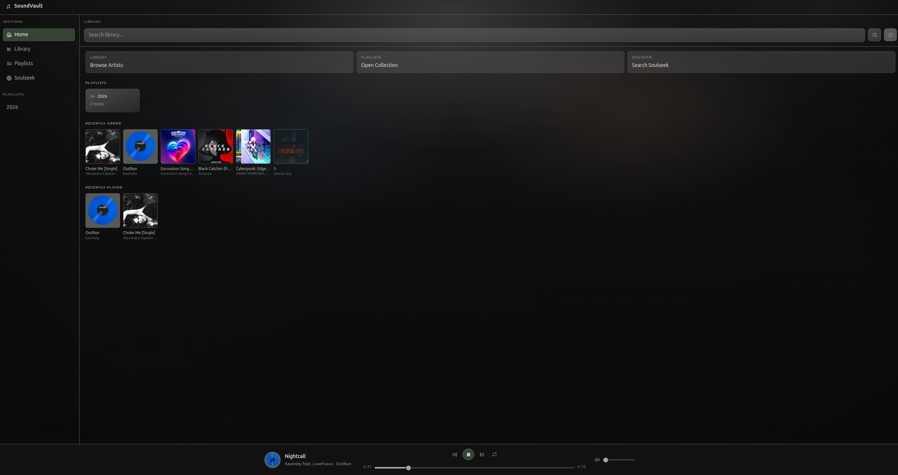
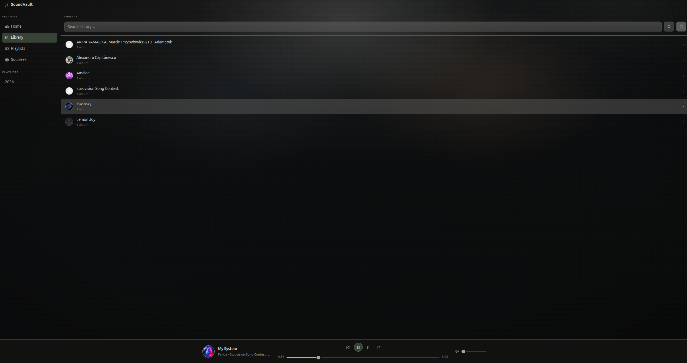
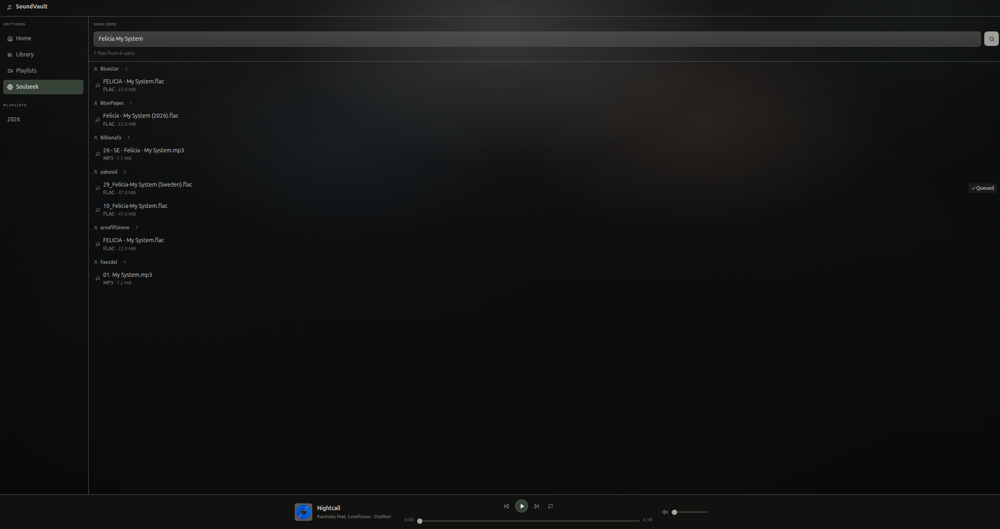

# SoundVault

[](https://github.com/rkanapka/sound-vault/actions/workflows/ci.yml)
[](https://codecov.io/gh/rkanapka/sound-vault)

A self-hosted music app that unifies [Navidrome](https://github.com/navidrome/navidrome/) and [slskd](https://github.com/slskd/slskd) into a single web interface.

**Navidrome** is a self-hosted music server. It indexes your local music files, exposes them via the Subsonic API, and handles streaming. SoundVault uses it as the music library backend - browsing artists and albums, playing songs, and fetching cover art all go through Navidrome.

**Soulseek** is a peer-to-peer network for sharing music. slskd is a self-hosted Soulseek client with an HTTP API. SoundVault uses it to search the Soulseek network and queue downloads directly from the UI - so you can find a release, download it, and it lands in your music folder where Navidrome picks it up after a scan.

## Screenshots

| Home | Library | Soulseek |
|------|---------|----------|
|  |  |  |

## Architecture

```
┌─────────────────────────────────────────────┐
│  Browser                                    │
│  React frontend (Vite + Tailwind)           │
└──────────────────┬──────────────────────────┘
                   │
┌──────────────────▼──────────────────────────┐
│  sound-vault  :7070                         │
│  FastAPI (Python 3.14)                      │
│  · /api/library/*  → Navidrome              │
│  · /api/soulseek/* → slskd                  │
└───────────┬─────────────┬───────────────────┘
            │             │
┌───────────▼──┐  ┌───────▼──────┐
│  navidrome   │  │  slskd       │
│  :4533       │  │  :5030       │
│  music lib   │  │  Soulseek    │
└───────┬──────┘  └──────┬───────┘
        │                │
        └───────┬─────────┘
         /music (host volume)
```

## Requirements

- Docker + Docker Compose
- A Soulseek account

## Setup

**1. Clone and configure**

```bash
git clone https://github.com/rkanapka/sound-vault.git
cd sound-vault
cp .env.example .env
```

Edit `.env`:

| Variable | Description |
|---|---|
| `MUSIC_DIR` | Absolute path to your music folder on the host |
| `SLSKD_USERNAME` | Your Soulseek username |
| `SLSKD_PASSWORD` | Your Soulseek password |
| `NAVIDROME_USER` | Navidrome admin username (set after first login) |
| `NAVIDROME_PASS` | Navidrome admin password (set after first login) |

**2. First run - set up Navidrome**

```bash
docker compose up -d navidrome
```

Open `http://localhost:4533`, complete the Navidrome setup wizard, then set the credentials in `.env` to match.

**3. Start all services**

```bash
docker compose up -d
```

| Service | URL | Notes |
|---|---|---|
| SoundVault | `http://localhost:7070` | Main app |
| Navidrome | `http://localhost:4533` | Direct access |
| slskd | `http://localhost:5030` | Direct access |

**Common commands**

```bash
docker compose up -d          # start all services in background
docker compose down           # stop all services
docker compose restart        # restart all services
docker compose logs -f        # stream logs from all services
docker compose logs -f sound-vault  # stream logs from one service
docker compose up -d --build  # rebuild image and restart (after code changes)
docker compose ps             # show running services and their status
```

## Homelab / external use

To run sound-vault without cloning the repo, download the compose file and environment template:

```bash
curl -O https://raw.githubusercontent.com/rkanapka/sound-vault/main/docker-compose.yml
curl -o .env https://raw.githubusercontent.com/rkanapka/sound-vault/main/.env.example
```

Edit `.env` with your settings, then start everything:

```bash
docker compose up -d
```

navidrome and slskd are included in the compose file - nothing to copy-paste.

**Pinning a version**

Set `SOUNDVAULT_IMAGE_TAG` in `.env` to lock to a specific release:

```
SOUNDVAULT_IMAGE_TAG=1.2.3
```

Leave it as `latest` for rolling updates. Re-download `docker-compose.yml` to pick up upstream
changes to the navidrome/slskd service definitions.

**Remapping the host port**

```
SOUNDVAULT_PORT=7070
```

## Development

**Backend** (Python 3.14, FastAPI)

```bash
python -m venv .venv && source .venv/bin/activate
pip install -r requirements-dev.txt
NAVIDROME_USER=admin NAVIDROME_PASS=admin PYTHONPATH=backend uvicorn main:app --reload
```

Lint and format:

```bash
ruff check backend/        # lint
ruff check --fix backend/  # lint with auto-fix
ruff format backend/       # format
```

Test:

```bash
pytest
```

**Frontend** (Node 20, npm 11, React + Vite)

```bash
cd frontend
npm install
npm run dev
```

Lint and format:

```bash
cd frontend
npm run lint          # ESLint check
npm run lint:fix      # ESLint with auto-fix
npm run format        # Prettier format
npm run format:check  # Prettier check (CI)
```

The Vite dev server proxies `/api/*` to the backend.

## Stack

| Layer | Tech |
|---|---|
| Frontend | React 18, Vite 7, Tailwind CSS 3 |
| Backend | Python 3.14, FastAPI 0.135, httpx 0.27 |
| Music server | Navidrome (Subsonic API) |
| Downloader | slskd (Soulseek) |
| Container | Docker, Node 20 / npm 11 (build), Python 3.14-slim (runtime) |
